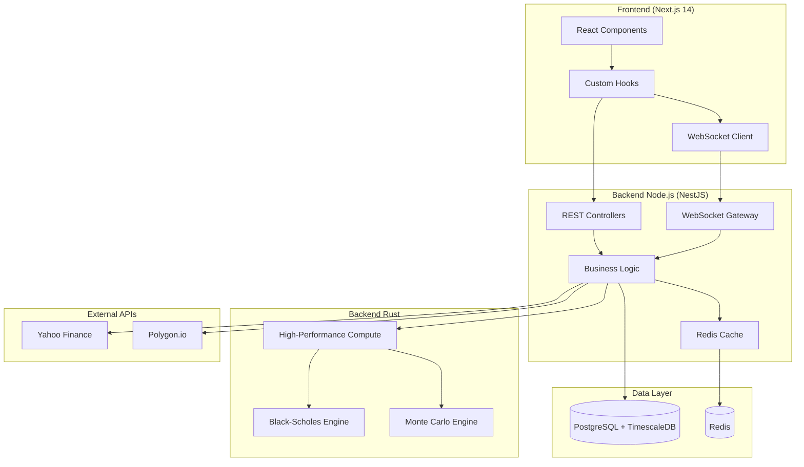
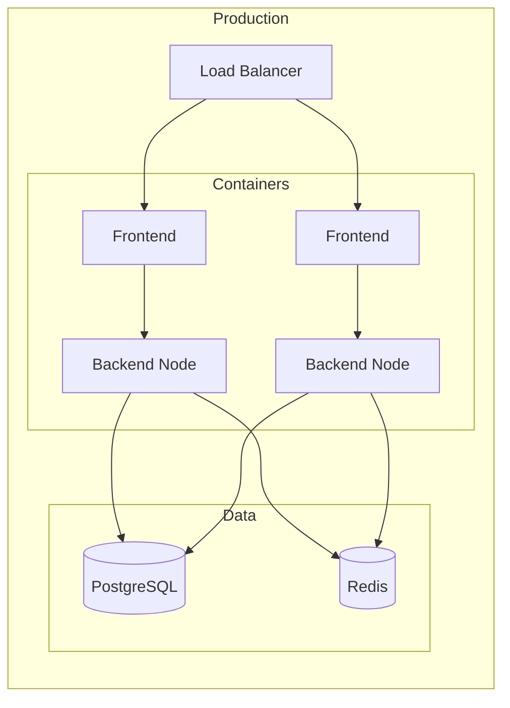

# CapexCycleOS Architecture

> **Version:** 2.0 | **Last Updated:** 2026-02-03

## System Overview



---

## Component Architecture

### Frontend Layer
| Component | Technology | Purpose |
|-----------|------------|---------|
| Framework | Next.js 14 | App Router, SSR |
| UI | React 18 | Component-based UI |
| Charts | Recharts, Plotly | Data visualization |
| Animations | Framer Motion | Premium UX |
| WebSocket | Socket.IO Client | Real-time updates |
| Styling | Tailwind CSS | Utility-first CSS |

### Backend Node.js (NestJS)
| Module | Purpose | Key Features |
|--------|---------|--------------|
| MarketData | Stock/options data | Yahoo Finance integration |
| Risk | Risk analytics | VaR, Component VaR, GARCH |
| Options | Greeks calculation | Black-Scholes, IV |
| Charts | Technical analysis | 8 indicators, OHLCV |
| Execution | Trade analytics | Slippage, backtesting |
| Realtime | Live data | WebSocket gateway |
| Cache | Performance | Redis with 15min TTL |

### Backend Rust
| Crate | Purpose | Performance |
|-------|---------|-------------|
| compute-core | Risk calculations | ~10x faster than JS |
| black-scholes | Options pricing | Native precision |
| monte-carlo | Simulation engine | Parallel execution |

---

## Data Flow

### REST API Flow
```
Client → HTTP Request → Controller → Service → Cache Check
                                         ↓
                               Cache Hit? ← Redis
                                    ↓ No
                            External API / DB
                                    ↓
                               Cache Store → Response
```

### WebSocket Flow
```
Client → Connect → Authenticate → Subscribe(ticker)
                                       ↓
                            Add to Room(ticker)
                                       ↓
                            Interval Emit → Price Update
                                       ↓
                            Client Receives → UI Update
```

---

## API Endpoints Summary

| Category | Endpoints | Caching |
|----------|-----------|---------|
| Market Data | 5 | 15 min |
| Charts | 3 | 15 min |
| Risk | 8 | 5 min |
| Options | 4 | 5 min |
| Execution | 6 | None |
| **Total** | **26+** | |

---

## Deployment Architecture



### Docker Services
- `postgres` - TimescaleDB for time-series data
- `redis` - Caching and session storage
- `backend` - Rust high-performance API
- `backend-node` - NestJS API
- `frontend` - Next.js application

---

## Security

| Layer | Implementation |
|-------|----------------|
| API | JWT authentication |
| Database | Encrypted connections |
| Secrets | Environment variables |
| CORS | Configured origins |
| Rate Limiting | Per-endpoint limits |

---

## Performance Metrics

| Metric | Target | Actual |
|--------|--------|--------|
| API Response | <200ms | ~150ms |
| Cached Response | <20ms | ~10ms |
| WebSocket Latency | <500ms | ~300ms |
| Chart Render | <100ms | ~50ms |

---

## Technology Stack

**Frontend:**
- Next.js 14, React 18, TypeScript
- Recharts, Plotly.js, Framer Motion
- Tailwind CSS, Lucide Icons

**Backend:**
- NestJS, TypeScript, Node.js 20
- Rust (compute-core)
- Socket.IO

**Data:**
- PostgreSQL 15 + TimescaleDB
- Redis 7

**Infrastructure:**
- Docker, GitHub Actions
- GHCR for container registry
